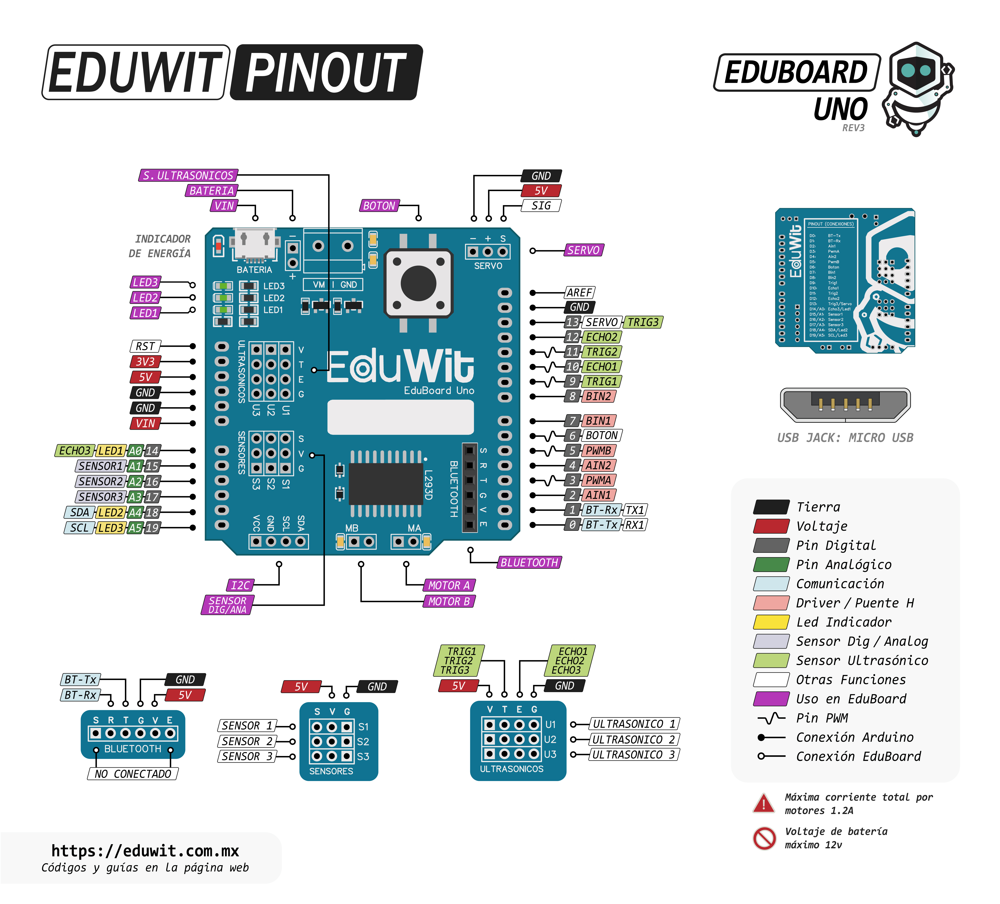

[](https://github.com/EduWit-Dev/EduWit/releases)
[](LICENSE.txt)

# EduWit para Arduino

Biblioteca oficial para utilizar **EduBoard UNO** desde Arduino IDE.
 Los ejemplos están dirigidos a personas sin experiencia previa, pero 
 conservan el vocabulario técnico necesario.

## Diagrama de conexiones (Pinout)

<p align="center">
  <a href="extras/EduBoard_UNO_Pinout.jpg">
    
  </a>
  <br>
  <sub><i>(Haz clic en la imagen para verla en tamaño completo)</i></sub>
</p>

## Instalación

#### Opción 1: Desde Arduino IDE (Recomendado)
1. Abre Arduino IDE.
2. Ve al **Gestor de bibliotecas** (icono de libros en la barra lateral izquierda o *Herramientas > Administrar bibliotecas...*).
3. Busca **EduWit**.
4. Haz clic en **Instalar** (asegúrate de que esté seleccionada la versión 1.1.2).

#### Opción 2: Instalación manual (.ZIP)
1. Descarga el archivo ZIP.
2. En Arduino IDE: **Programa > Incluir librería > Añadir biblioteca .ZIP...**

## Ruta de aprendizaje

| # | Ejemplo | Contenido |
|---:|---|---|
| 01 | LEDs | Encender, apagar y cambiar el tiempo |
| 02 | Botón y LED | Una entrada controla una salida |
| 03 | Motores | Dirección, velocidad, freno y apagado |
| 04 | Servomotor | Posiciones angulares |
| 05 | Buzzer | Frecuencia, nota y duración |
| 06 | Sensor digital y analógico | Comparación entre 0/1 y 0–1023 |
| 07 | Sensor de línea | Detección de blanco y negro |
| 08 | Ultrasónico | Medición y comparación de distancia |
| 09 | Puerto externo | Uso de S1 con instrucciones Arduino |
| 10 | Bluetooth | Recepción de comandos con `switch-case` |

## API principal

### Inicialización

```cpp
eduwit.iniciar();
```

### Movimiento

```cpp
eduwit.moverMotor(MA, ADELANTE, 50);
eduwit.frenarMotor(MA);
eduwit.apagarMotor(AMBOS);
eduwit.girarServo(90);
```

### Luz y sonido

```cpp
eduwit.fijarLed(LED1, ENCENDIDO);
eduwit.tocarTono(440, 500, S1);
eduwit.tocarNota(DO4, 500, S1);
eduwit.detenerSonido(S1);
```

### Entradas y sensores

```cpp
eduwit.botonPresionado();
eduwit.esperarBoton();
eduwit.leerDigital(S1);
eduwit.leerAnalogico(S1);
eduwit.detectaLinea(S1, NEGRO);
eduwit.medirDistancia();
eduwit.medirDistancia(U2);
eduwit.detectaObjeto(U1, '<', 30);
eduwit.detectaObjeto(U1, '>', 30);
```

### Serial y Bluetooth

```cpp
eduwit.configurarSerial(9600);
eduwit.enviarSerial("Hola");

char comando = eduwit.leerComandoBluetooth();
if (comando != '\0') {
  eduwit.enviarBluetooth(comando);
}
```

## Opciones disponibles

```cpp
MA, MB, AMBOS
ADELANTE, ATRAS
LED1, LED2, LED3
ENCENDIDO, APAGADO
S1, S2, S3
BLANCO, NEGRO
U1, U2, U3
DO3 ... SI3
DO4 ... SI4
```

## Bluetooth y USB

Bluetooth y USB comparten RX/TX en el Arduino UNO. Desconecta el módulo Bluetooth
durante la carga y no abras el Monitor Serie mientras lo utilizas. Ambos extremos
deben tener la misma velocidad de comunicación.

`leerComandoBluetooth()` entrega un comando visible por llamada. Esto permite
procesar las órdenes en el orden en que llegan sin descartar las anteriores.

## Recursos compartidos

- SERVO tiene prioridad sobre U3 porque ambos utilizan D13.
- Cuando U3 está activo, U3 tiene prioridad sobre LED1 porque comparte A0.
- Si SERVO impide que U3 se active, LED1 continúa disponible.
- `medirDistancia(U3)` devuelve `DISTANCIA_NO_DISPONIBLE` (`-1`) cuando SERVO
  bloquea U3.
- Después de producir sonido, S1, S2 o S3 vuelve a quedar disponible como entrada.
